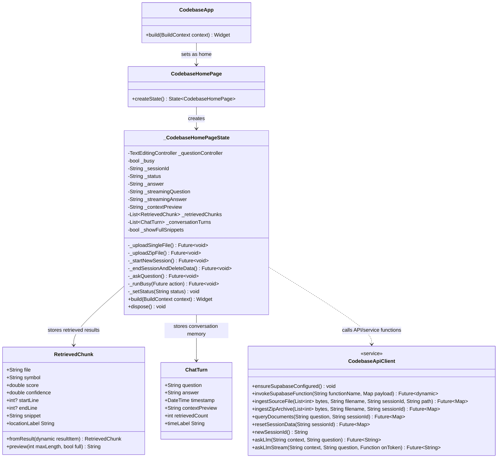

# Frontend LLD Class Diagram

This diagram focuses on the core frontend classes and the main service module used by the Flutter web app.

```mermaid
classDiagram
    direction TB

    class CodebaseApp {
        +build(BuildContext context) Widget
    }

    class CodebaseHomePage {
        +createState() State~CodebaseHomePage~
    }

    class _CodebaseHomePageState {
        -TextEditingController _questionController
        -bool _busy
        -String _sessionId
        -String _status
        -String _answer
        -String _streamingQuestion
        -String _streamingAnswer
        -String _contextPreview
        -List~RetrievedChunk~ _retrievedChunks
        -List~ChatTurn~ _conversationTurns
        -bool _showFullSnippets
        -_uploadSingleFile() Future~void~
        -_uploadZipFile() Future~void~
        -_startNewSession() Future~void~
        -_endSessionAndDeleteData() Future~void~
        -_askQuestion() Future~void~
        -_runBusy(Future action) Future~void~
        -_setStatus(String status) void
        +build(BuildContext context) Widget
        +dispose() void
    }

    class ChatTurn {
        +String question
        +String answer
        +DateTime timestamp
        +String contextPreview
        +int retrievedCount
        +timeLabel String
    }

    class RetrievedChunk {
        +String file
        +String symbol
        +double score
        +double confidence
        +int? startLine
        +int? endLine
        +String snippet
        +fromResult(dynamic resultItem) RetrievedChunk
        +locationLabel String
        +preview(int maxLength, bool full) String
    }

    class CodebaseApiClient {
        <<service>>
        +ensureSupabaseConfigured() void
        +invokeSupabaseFunction(String functionName, Map payload) Future~dynamic~
        +ingestSourceFile(List~int~ bytes, String filename, String sessionId, String path) Future~Map~
        +ingestZipArchive(List~int~ bytes, String filename, String sessionId) Future~Map~
        +queryDocuments(String question, String sessionId) Future~Map~
        +resetSessionData(String sessionId) Future~Map~
        +newSessionId() String
        +askLlm(String context, String question) Future~String~
        +askLlmStream(String context, String question, Function onToken) Future~String~
    }

    CodebaseApp --> CodebaseHomePage : sets as home
    CodebaseHomePage --> _CodebaseHomePageState : creates
    _CodebaseHomePageState --> RetrievedChunk : stores retrieved results
    _CodebaseHomePageState --> ChatTurn : stores conversation memory
    _CodebaseHomePageState ..> CodebaseApiClient : calls API/service functions
```
