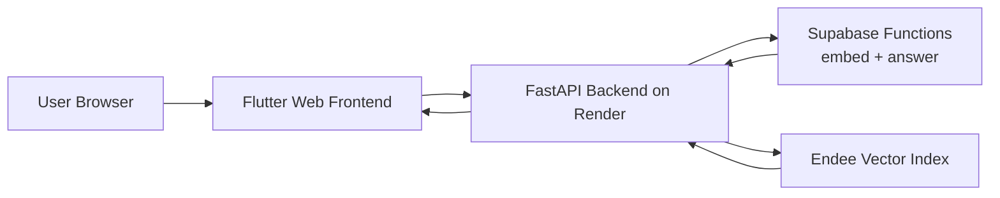

# Codebase QA App

Flutter web app for codebase upload + RAG chat.:

- Frontend: GitHub Pages (Flutter web build)
- Backend: Render (FastAPI)

## High-Level Design

## Low Level Design

see `frontend_LLD_CLASS_DIAGRAM.md`
and for flow see `flow.md`

## Deployment Split (Two Repos)

1. Frontend repo:
	- Include Flutter project files needed for web.
	- Exclude backend folder if splitting from monorepo.
	- Used github actions workflow to build on push to GitHub Pages. Check `.github/workflow`
2. Backend repo:
	- Include only `backend/` content.
	- Deploy with Render using `uvicorn main:app --host 0.0.0.0 --port $PORT`.

Detailed split checklist and env vars:

- `DEPLOYMENT_CHECKLIST.md`

## Supabase Edge Functions (What They Do)

- `embed` function:
  - Receives plain text from backend.
  - Calls Hugging Face embedding model (`BAAI/bge-small-en-v1.5`).
  - Returns numeric embedding vector.
  - Used by backend during ingest and query embedding.
- `answer` function:
  - Receives retrieved context + user question.
  - Calls Hugging Face chat/generation models to produce final answer.
  - Supports streaming responses for token-by-token UI updates.
  - Returns fallback context-grounded answer if generation providers fail.

## Runtime Constraints

- Retrieval chunk count is fixed at top 3.
- Question length must be less than 100 words.

## Extra Flow Docs

- Frontend flow: `flow.md`
- Backend flow: `backend/flow.md`

## What This App Is

This project is a codebase question-answering application built for uploading source files or zipped repositories, indexing them for semantic search, and then letting users ask natural-language questions about the uploaded code.

At a practical level, the app helps a user:

- upload a single source file or a full `.zip` codebase
- split code into searchable chunks
- generate embeddings for those chunks
- store the vectors in Endee
- retrieve the most relevant chunks for a question
- generate a final answer grounded in the retrieved code context

The frontend is a Flutter web UI, while the backend is a FastAPI service that handles ingestion, chunking, vector storage, session isolation, and retrieval.

## What The App Does

The app supports a simple RAG flow for code understanding:

1. A user uploads a file or a zip archive from the browser.
2. The Flutter frontend sends the upload to the Python backend.
3. The backend reads supported source/config files and chunks them into logical units.
4. Each chunk is embedded through the Supabase `embed` function.
5. The backend stores each embedding in Endee together with metadata like file path, symbol name, line numbers, chunk type, and session id.
6. When the user asks a question, the backend embeds the question and searches Endee for the top 3 matching chunks.
7. The frontend combines retrieved snippets with session memory and sends that context to the Supabase `answer` function.
8. The final answer is streamed back into the UI so the user sees it appear live.

This makes the app useful for:

- understanding unfamiliar codebases
- locating where business logic lives
- answering architecture or implementation questions
- inspecting classes, functions, imports, and support files
- keeping temporary session-scoped code context without mixing different uploads

## Main Features

- Upload a single source file directly from the browser
- Upload a `.zip` archive containing a larger codebase
- Automatic chunking for Python, JavaScript, TypeScript, Java, Go, C/C++, C#, Ruby, PHP, Swift, JSON, YAML, XML, TOML, Gradle, and other support files
- Session-based indexing so one upload session stays isolated from another
- Semantic retrieval with a fixed `top_k = 3`
- Live streamed answer generation in the UI
- Session memory in the frontend for follow-up questions
- Reset flow that deletes stored vectors for the active session
- TTL-based cleanup of expired backend sessions

## Tech Stack Used

### Frontend

- Flutter Web
- Dart
- `http` package for backend and Supabase requests
- `file_picker` for selecting local source files and zip archives
- Material 3 UI

### Backend

- FastAPI
- Uvicorn
- `python-multipart` for file uploads
- custom chunking logic for different code and support file types

### Retrieval And AI Layer

- Endee for vector indexing and similarity search
- Supabase Edge Functions as the bridge for embedding and answer generation
- Hugging Face embedding model: `BAAI/bge-small-en-v1.5`
- Hugging Face generation/chat models behind the `answer` function

## How Endee Is Used To Retrieve Data

Endee is the vector database layer of this app. It is used after the backend converts code chunks into embeddings.

### During ingest

When a file or zip is uploaded:

- the backend chunks the file into meaningful pieces such as imports, functions, classes, support files, or fallback line blocks
- each chunk is converted into a richer embedding input that includes:
  - session id
  - file path
  - language
  - chunk type
  - symbol name
  - line numbers
  - raw chunk text
- that text is sent to the Supabase `embed` function
- the returned embedding vector is upserted into Endee

Each Endee record stores:

- a unique vector id
- the vector itself
- metadata containing the original chunk details and text

This metadata is important because retrieval does not return only similarity scores; it also returns the original file/snippet information needed to explain the answer in context.

### During query

When the user asks a question:

- the question is embedded using the same embedding pipeline
- the backend queries the existing Endee index
- the search is filtered by `session_id` so only vectors from the current upload session are searched
- the backend oversamples results internally and then deduplicates them
- the final response returns the top 3 relevant chunks plus a combined text context

The retrieved chunk metadata includes items like:

- file path
- symbol name
- line range
- chunk type
- snippet text

That retrieved context is then sent to the `answer` function so the generated answer stays grounded in the uploaded code.

### Session isolation and cleanup

Endee is also part of the session lifecycle:

- every stored vector is tagged with a `session_id`
- vector ids are tracked locally in a session manifest
- resetting a session deletes that session's vectors from Endee
- expired sessions can be cleaned automatically using TTL logic

This prevents different uploads from polluting each other and keeps temporary code indexing manageable.

## How Chunking Works

The backend does not store entire codebases as one big blob. It first breaks files into smaller retrievable units.

- Python files are parsed with `ast` and split into imports, classes, and functions when possible
- Braced languages use pattern-based extraction for classes and functions
- Support files like `package.json`, `requirements.txt`, `pom.xml`, `go.mod`, and similar files are stored as support-file chunks
- Files that cannot be parsed structurally fall back to line-based chunking

This chunking strategy improves retrieval quality because the embedding usually represents a smaller, more meaningful unit of code.

## Frontend And Backend Responsibilities

### Flutter frontend

The frontend is responsible for:

- letting the user upload files or zip archives
- creating a new session id
- calling the FastAPI backend for ingest, query, and reset operations
- showing retrieved chunks
- maintaining lightweight conversation memory for follow-up questions
- streaming generated answers into the interface

### FastAPI backend

The backend is responsible for:

- validating uploads and questions
- extracting source files from zip archives
- identifying supported code/config files
- chunking source content
- generating embeddings through Supabase
- creating or loading the Endee index
- storing and searching vectors
- filtering data by session id
- deleting vectors during reset or TTL cleanup

## Important Runtime Behavior

- Retrieval is fixed to top 3 chunks
- Questions must be under 100 words
- The Endee index is created automatically on first successful write
- If no vectors exist yet, querying will fail until at least one file or zip has been ingested
- Answer generation is separate from retrieval: Endee retrieves context, Supabase generates the final response
- If answer generation fails, the UI still shows retrieved chunks so the user can inspect the relevant code manually

## Backend Endpoints

The main backend endpoints are:

- `GET /health` for a simple health check
- `POST /ingest/file` to upload and index one file
- `POST /ingest/zip` to upload and index a zip archive
- `POST /store` to manually store a vector payload
- `POST /search` to search using a provided vector
- `POST /query` to embed a question and retrieve the top matching chunks
- `POST /session/reset` to delete vectors for one session

## Configuration Notes

Important environment/config values used by the project include:

- `ENDEE_TOKEN`
- `ENDEE_INDEX_NAME`
- `ENDEE_INDEX_SPACE_TYPE`
- `ENDEE_INDEX_PRECISION`
- `SUPABASE_URL`
- `SUPABASE_ANON_KEY`
- `SUPABASE_EMBED_FUNCTION`
- `SESSION_TTL_SECONDS`
- `MAX_FALLBACK_LINES`
- frontend `--dart-define` values such as `SUPABASE_URL`, `SUPABASE_ANON_KEY`, and `PY_BACKEND_URL`

## Why This Architecture Matters

This app separates retrieval from answer generation in a clean way:

- Flutter provides the user-facing upload and chat experience
- FastAPI handles code-aware ingestion and retrieval orchestration
- Supabase functions centralize embedding and LLM response generation
- Endee stores vectors and returns the most semantically relevant code chunks

That separation makes the system easier to deploy, extend, and debug. It also keeps the retrieval layer reusable even if the answer-generation model changes later.
