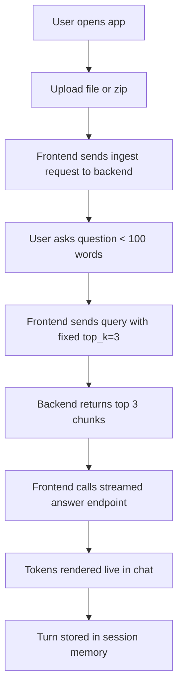

# Frontend Flow

```mermaid
flowchart TD
  A[User opens app] --> B[Upload file or zip]
  B --> C[Frontend sends ingest request to backend]
  C --> D[User asks question < 100 words]
  D --> E[Frontend sends query with fixed top_k=3]
  E --> F[Backend returns top 3 chunks]
  F --> G[Frontend calls streamed answer endpoint]
  G --> H[Tokens rendered live in chat]
  H --> I[Turn stored in session memory]
```